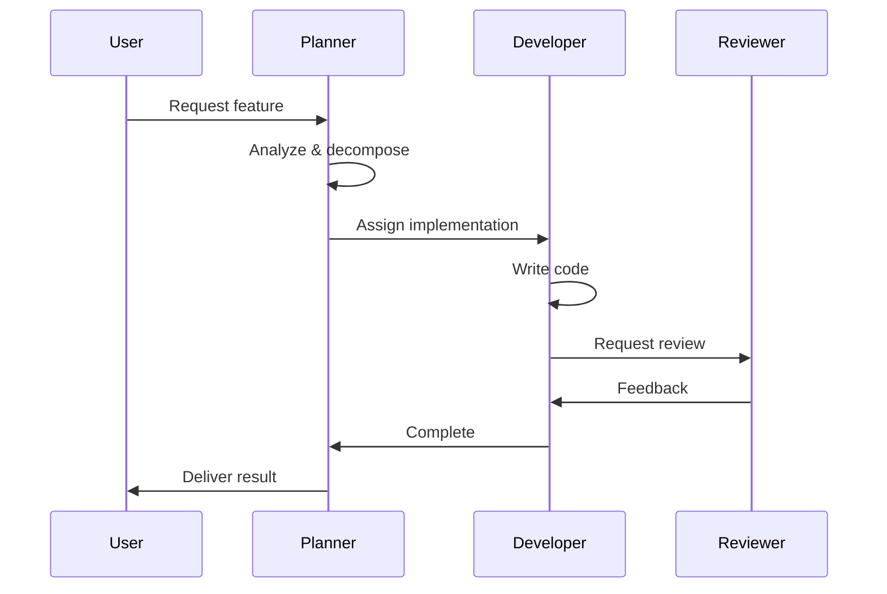

# Multi-Agent Collaboration

> Patterns for effective agent coordination.

## Instructions

### 1. Agent Role Definition

```markdown
## Specialist Roles

| Role | Responsibility | Skills |
|------|----------------|--------|
| **Planner** | Decompose tasks | reasoning, planning |
| **Researcher** | Gather information | search, analysis |
| **Developer** | Write code | implementation |
| **Reviewer** | Quality check | testing, review |
| **Documenter** | Write docs | documentation |
```

### 2. Task Delegation

```markdown
## Delegation Protocol

1. **Assess**: What expertise is needed?
2. **Assign**: Match task to specialist
3. **Brief**: Provide clear context
4. **Monitor**: Track progress
5. **Integrate**: Combine results

### Delegation Template

```
TASK: [Description]
ASSIGNED TO: [Role]
CONTEXT: [What they need to know]
DELIVERABLE: [Expected output]
DEADLINE: [When needed]
```
```

### 3. Communication Protocols

```markdown
## Message Format

### Request
{
  "from": "planner",
  "to": "developer",
  "type": "task",
  "content": {
    "action": "implement",
    "file": "UserService.ts",
    "requirements": ["..."]
  }
}

### Response
{
  "from": "developer",
  "to": "planner",
  "type": "result",
  "status": "complete",
  "content": {
    "files_changed": ["UserService.ts"],
    "summary": "Added user validation"
  }
}
```

### 4. Handoff Patterns

```markdown
## Clean Handoff Checklist

When passing work to another agent:

- [ ] Summarize what was done
- [ ] Explain current state
- [ ] List remaining tasks
- [ ] Note any blockers
- [ ] Provide relevant context

### Example

```
## Handoff: Planner → Developer

### Completed
- Analyzed requirements
- Identified 3 main components

### Current State
- Types defined in types/user.ts
- No implementation yet

### Next Steps
1. Create UserService in services/
2. Implement CRUD operations
3. Add validation

### Context
- Use Prisma for DB
- Follow existing patterns in OrderService
```
```

### 5. Conflict Resolution

```markdown
## When Agents Disagree

1. **Identify**: What is the conflict?
2. **Evidence**: Gather supporting facts
3. **Evaluate**: Compare approaches
4. **Decide**: Choose best option
5. **Document**: Record decision and reasoning

### Common Conflicts

| Conflict | Resolution Strategy |
|----------|---------------------|
| Architecture choice | Evaluate trade-offs |
| Implementation approach | Prototype both |
| Priority disagreement | Align with user goal |
| Resource contention | Schedule or parallelize |
```

### 6. Workflow Orchestration



### 7. Shared Context

```markdown
## Context Sharing Rules

### Must Share
- Project constraints
- User preferences
- Critical decisions
- Error states

### May Share
- Implementation details
- Intermediate results
- Research findings

### Don't Share
- Internal reasoning
- Failed attempts
- Verbose logs
```

### 8. Progress Synchronization

```markdown
## Status Updates

### Format
| Agent | Task | Status | Blockers |
|-------|------|--------|----------|
| Developer | API endpoints | 🟢 Done | None |
| Reviewer | Code review | 🟡 WIP | Waiting for tests |
| Documenter | API docs | 🔴 Blocked | Need API specs |

### Sync Points
- After each phase completion
- When blocked
- When priorities change
- Before final delivery
```

## References

- [Multi-Agent Reinforcement Learning](https://arxiv.org/abs/1706.02275)
- [CrewAI Framework](https://github.com/joaomdmoura/crewAI)
- [AutoGen](https://microsoft.github.io/autogen/)
