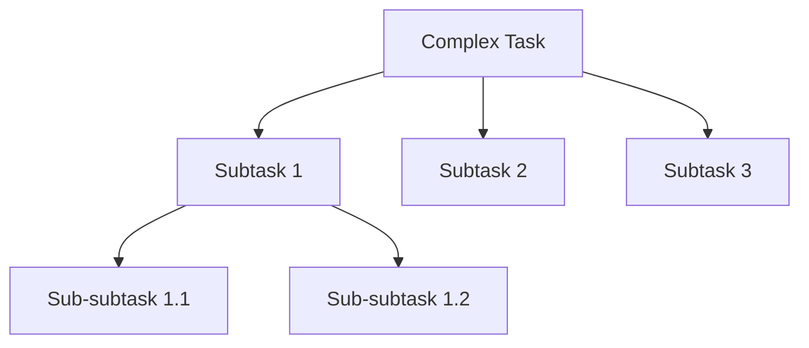

# Planning Strategies

> Structured approach for complex task execution.

## Instructions

### 1. Task Decomposition

Break large tasks into manageable subtasks:



```markdown
## Task Breakdown Template

### Main Goal: [Description]

#### Phase 1: Research
- [ ] Understand requirements
- [ ] Explore existing code
- [ ] Identify dependencies

#### Phase 2: Implementation
- [ ] Create types/interfaces
- [ ] Implement core logic
- [ ] Add error handling

#### Phase 3: Verification
- [ ] Test functionality
- [ ] Check edge cases
- [ ] Review code quality
```

### 2. Dependency Analysis

Before execution, identify dependencies:

```typescript
// Dependency Graph Example
const taskDependencies = {
  'create-api': [],                    // Independent
  'create-types': [],                   // Independent
  'create-service': ['create-types'],   // Depends on types
  'create-controller': ['create-service'], // Depends on service
  'write-tests': ['create-controller'],    // Depends on controller
};
```

### 3. Execution Order

```markdown
## Execution Strategy

1. **Parallel Tasks**: Independent tasks first
2. **Sequential Tasks**: Follow dependency order
3. **Validation Points**: Verify after each phase
4. **Rollback Plan**: Know how to undo
```

### 4. Goal-Oriented Planning

```markdown
## SMART Goals

- **S**pecific: Clear, unambiguous objective
- **M**easurable: Quantifiable success criteria
- **A**chievable: Realistic within constraints
- **R**elevant: Aligned with user needs
- **T**ime-bound: Has clear completion point
```

### 5. Adaptive Re-Planning

When plans fail, adapt:

```markdown
## Re-Planning Protocol

1. **Detect**: Identify the blocker
2. **Analyze**: Why did the plan fail?
3. **Adapt**: Modify the approach
4. **Continue**: Resume with new plan

### Common Blockers

| Blocker | Response |
|---------|----------|
| Missing dependency | Install or find alternative |
| Type error | Fix types first |
| API unavailable | Mock or wait |
| Unclear requirement | Ask user |
```

### 6. Progress Tracking

```markdown
## Progress Template

### Task: [Name]
- Status: 🟡 In Progress
- Progress: 3/7 steps complete
- Blockers: None
- ETA: 2 more tool calls

### Completed
- [x] Step 1: Research
- [x] Step 2: Types
- [x] Step 3: Core logic

### Remaining
- [ ] Step 4: Error handling
- [ ] Step 5: Tests
- [ ] Step 6: Documentation
- [ ] Step 7: Review
```

### 7. Risk Assessment

```markdown
## Risk Matrix

| Risk | Probability | Impact | Mitigation |
|------|-------------|--------|------------|
| Breaking change | Medium | High | Test thoroughly |
| Performance issue | Low | Medium | Profile if needed |
| Type mismatch | High | Low | Use strict mode |
```

## References

- [Hierarchical Task Network](https://en.wikipedia.org/wiki/Hierarchical_task_network)
- [Goal-Oriented Action Planning](https://alumni.media.mit.edu/~jorkin/goap.html)
