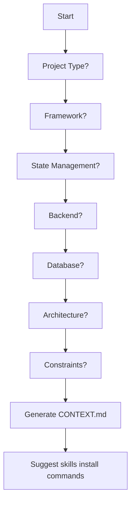

---
name: project-init
description: Project setup wizard for AI agents. Use when starting a new project to ask about stack and constraints, then generate .agents/CONTEXT.md with recommended skills, folder structure, and coding rules tailored to the project.
---

# Project Init Wizard

> Interactive project setup with intelligent skill selection.

## Wizard Flow



---

## Questions to Ask

### Phase 1: Basic Info
| # | Question | Options |
|---|----------|---------|
| 1 | Project name? | (text input) |
| 2 | Project type? | Chat App, E-commerce, Admin Panel, Landing Page, SaaS, API Backend, Portfolio, Blog |
| 3 | Monorepo? | Yes / No |

### Phase 2: Frontend
| # | Question | Options |
|---|----------|---------|
| 4 | Frontend framework? | Next.js 14+, Vite + React, Remix, None (API only) |
| 5 | TypeScript? | Yes / No |
| 6 | UI Library? | Tailwind CSS, shadcn/ui, MUI, Ant Design, Chakra UI, None |
| 7 | State management? | TanStack Query, Zustand, Redux Toolkit, Jotai, None |

### Phase 3: Backend
| # | Question | Options |
|---|----------|---------|
| 8 | Backend framework? | NestJS, Express, Next.js API Routes, Hono, None |
| 9 | Database? | PostgreSQL, MySQL, MongoDB, SQLite, Supabase, None |
| 10 | ORM? | Prisma, Drizzle, TypeORM, Mongoose, None |
| 11 | Authentication? | NextAuth, Clerk, Supabase Auth, JWT Custom, None |

### Phase 4: Architecture
| # | Question | Options |
|---|----------|---------|
| 12 | Folder structure? | Feature-Sliced Design (FSD), Feature-based, Domain-Driven (DDD), Type-based (classic) |
| 13 | Package manager? | pnpm, npm, yarn, bun |
| 14 | Testing? | Vitest + RTL, Playwright, Jest, None |
| 15 | Deployment? | Vercel, Railway, Docker, AWS, Self-hosted |

---

## Skill Mapping Table

Based on answers, select skills:

### Frontend Mapping
| Answer | Skills to Add |
|--------|---------------|
| Next.js 14+ | `react-core`, `react-nextjs` |
| Vite + React | `react-core`, `react-vite` |
| TanStack Query | `tanstack-query` |
| Zustand | `zustand` |
| Redux Toolkit | `redux` |
| TypeScript: Yes | `typescript` |

### Backend Mapping
| Answer | Skills to Add |
|--------|---------------|
| NestJS | `nestjs` |
| Any backend | `security`, `errors` |

### Architecture Mapping
| Answer | Skills to Add |
|--------|---------------|
| Monorepo: Yes | `monorepo` |
| Testing: Yes | `testing` |
| Any project | `git`, `workflow` |

### Project Type Mapping
| Project Type | Additional Skills |
|--------------|-------------------|
| Chat App | Real-time patterns, WebSocket |
| E-commerce | Payment, cart patterns |
| Admin Panel | Table, form patterns |
| SaaS | Auth, subscription patterns |

---

## Output: .agents/CONTEXT.md

Generate this file in the project root:

```markdown
# [Project Name] Context

> Auto-generated by agent-project-init skill

## Technology Stack

| Layer | Technology |
|-------|------------|
| Framework | Next.js 14 (App Router) |
| Language | TypeScript (strict) |
| Styling | Tailwind CSS + shadcn/ui |
| State (Server) | TanStack Query |
| State (Client) | Zustand |
| Backend | NestJS |
| Database | PostgreSQL |
| ORM | Prisma |
| Auth | NextAuth |
| Package Manager | pnpm |

## Installed Skills

Run these commands to install recommended skills:

\`\`\`bash
# Core
npx skills add Alicoder001/agent-skills --skill typescript
npx skills add Alicoder001/agent-skills --skill git
npx skills add Alicoder001/agent-skills --skill security
npx skills add Alicoder001/agent-skills --skill errors

# Frontend
npx skills add Alicoder001/agent-skills --skill react-core
npx skills add Alicoder001/agent-skills --skill react-nextjs
npx skills add Alicoder001/agent-skills --skill tanstack-query
npx skills add Alicoder001/agent-skills --skill zustand

# Backend
npx skills add Alicoder001/agent-skills --skill nestjs

# Or install all at once:
npx skills add Alicoder001/agent-skills
\`\`\`

## Project Structure (FSD)

\`\`\`
src/
├── app/                    # Next.js App Router
│   ├── (auth)/            # Auth route group
│   ├── (dashboard)/       # Dashboard routes
│   ├── api/               # API routes
│   └── layout.tsx
├── entities/              # Business entities
│   ├── user/
│   └── product/
├── features/              # Feature modules
│   ├── auth/
│   └── cart/
├── shared/                # Shared code
│   ├── ui/               # UI components
│   ├── lib/              # Utilities
│   ├── api/              # API client
│   └── config/           # Configuration
├── widgets/               # Composite components
└── processes/             # Complex flows
\`\`\`

## Coding Rules

### Components
- Max 200 lines per component
- One component per file
- Use functional components only
- Extract hooks to separate files

### TypeScript
- Strict mode enabled
- No `any` type
- Explicit return types for public APIs
- Use `interface` for objects, `type` for unions

### State Management
- Server state -> TanStack Query
- Client state -> Zustand
- Form state -> React Hook Form
- URL state -> Router params

### Git Commits
- Use conventional commits
- Format: `type(scope): description`
- Types: feat, fix, docs, style, refactor, test, chore

### File Naming
- Components: PascalCase (`UserCard.tsx`)
- Hooks: camelCase with `use` prefix (`useAuth.ts`)
- Utils: camelCase (`formatDate.ts`)
- Types: PascalCase (`User.types.ts`)

## Commands

\`\`\`bash
pnpm dev          # Development server
pnpm build        # Production build
pnpm lint         # Lint code
pnpm test         # Run tests
pnpm db:push      # Push DB schema
pnpm db:studio    # Open Prisma Studio
\`\`\`

## Environment Variables

\`\`\`bash
# .env.local
DATABASE_URL=postgresql://...
NEXTAUTH_SECRET=xxx
NEXTAUTH_URL=http://localhost:3000
\`\`\`
```

---

## Example Interaction

**Agent:** Ready to set up your project. What's the project name?

**User:** TaskManager

**Agent:** Great. What type of project is it?
1. Chat App
2. E-commerce
3. Admin Panel
4. SaaS
5. API Backend

**User:** 4

**Agent:** SaaS it is. Which frontend framework?
1. Next.js 14+
2. Vite + React
3. API only

**User:** 1

**Agent:** Any constraints I should account for? (performance, SEO, accessibility, deployment)

**User:** SEO + Vercel

... (continues)

**Agent:** Done. `.agents/CONTEXT.md` is generated. Install the recommended skills:

```bash
npx skills add Alicoder001/agent-skills --skill typescript
npx skills add Alicoder001/agent-skills --skill react-nextjs
npx skills add Alicoder001/agent-skills --skill tanstack-query
npx skills add Alicoder001/agent-skills --skill nestjs
```

---

## References

- [Alicoder001/agent-skills](https://github.com/Alicoder001/agent-skills)
- [Feature-Sliced Design](https://feature-sliced.design/)
- [skills.sh](https://skills.sh)


