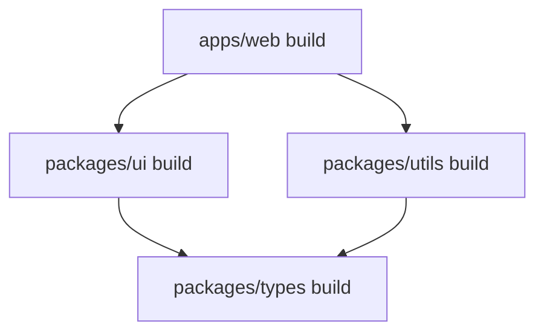

# Monorepo Architecture

> Scalable multi-package repository management with Turborepo.

## Instructions

### 1. Project Structure

```
my-monorepo/
├── apps/
│   ├── web/                 # Next.js main app
│   │   ├── package.json
│   │   └── src/
│   ├── admin/               # Admin dashboard
│   │   ├── package.json
│   │   └── src/
│   └── docs/                # Documentation site
│       ├── package.json
│       └── src/
├── packages/
│   ├── ui/                  # Shared UI components
│   │   ├── package.json
│   │   └── src/
│   ├── config/              # Shared configs (ESLint, TS)
│   │   ├── eslint/
│   │   └── typescript/
│   ├── utils/               # Shared utilities
│   │   ├── package.json
│   │   └── src/
│   └── types/               # Shared TypeScript types
│       ├── package.json
│       └── src/
├── package.json             # Root package.json
├── pnpm-workspace.yaml      # pnpm workspaces
├── turbo.json               # Turborepo config
└── .npmrc
```

### 2. Root package.json

```json
{
  "name": "my-monorepo",
  "private": true,
  "scripts": {
    "dev": "turbo dev",
    "build": "turbo build",
    "lint": "turbo lint",
    "test": "turbo test",
    "clean": "turbo clean && rm -rf node_modules",
    "format": "prettier --write \"**/*.{ts,tsx,md}\""
  },
  "devDependencies": {
    "turbo": "^2.0.0",
    "prettier": "^3.0.0"
  },
  "packageManager": "pnpm@9.0.0",
  "engines": {
    "node": ">=20"
  }
}
```

### 3. pnpm-workspace.yaml

```yaml
packages:
  - "apps/*"
  - "packages/*"
```

### 4. turbo.json

```json
{
  "$schema": "https://turbo.build/schema.json",
  "globalDependencies": [".env"],
  "tasks": {
    "build": {
      "dependsOn": ["^build"],
      "inputs": ["$TURBO_DEFAULT$", ".env*"],
      "outputs": [".next/**", "!.next/cache/**", "dist/**"]
    },
    "dev": {
      "cache": false,
      "persistent": true
    },
    "lint": {
      "dependsOn": ["^build"],
      "inputs": ["$TURBO_DEFAULT$"]
    },
    "test": {
      "dependsOn": ["^build"],
      "inputs": ["$TURBO_DEFAULT$"]
    },
    "clean": {
      "cache": false
    }
  }
}
```

### 5. Shared UI Package

```json
// packages/ui/package.json
{
  "name": "@repo/ui",
  "version": "0.0.0",
  "private": true,
  "exports": {
    "./button": "./src/button.tsx",
    "./card": "./src/card.tsx",
    "./input": "./src/input.tsx",
    "./*": "./src/*.tsx"
  },
  "scripts": {
    "lint": "eslint src/",
    "generate:component": "turbo gen react-component"
  },
  "peerDependencies": {
    "react": "^18.0.0"
  },
  "devDependencies": {
    "@repo/typescript-config": "workspace:*",
    "@repo/eslint-config": "workspace:*",
    "typescript": "^5.0.0"
  }
}
```

```tsx
// packages/ui/src/button.tsx
import { cn } from '@repo/utils';

interface ButtonProps extends React.ButtonHTMLAttributes<HTMLButtonElement> {
  variant?: 'primary' | 'secondary' | 'outline';
  size?: 'sm' | 'md' | 'lg';
}

export function Button({
  children,
  variant = 'primary',
  size = 'md',
  className,
  ...props
}: ButtonProps) {
  return (
    <button
      className={cn(
        'rounded-lg font-medium transition-colors',
        {
          'bg-blue-600 text-white hover:bg-blue-700': variant === 'primary',
          'bg-gray-200 text-gray-900 hover:bg-gray-300': variant === 'secondary',
          'border border-gray-300 hover:bg-gray-50': variant === 'outline',
        },
        {
          'px-3 py-1.5 text-sm': size === 'sm',
          'px-4 py-2 text-base': size === 'md',
          'px-6 py-3 text-lg': size === 'lg',
        },
        className
      )}
      {...props}
    >
      {children}
    </button>
  );
}
```

### 6. Shared TypeScript Config

```json
// packages/config/typescript/base.json
{
  "$schema": "https://json.schemastore.org/tsconfig",
  "compilerOptions": {
    "strict": true,
    "esModuleInterop": true,
    "skipLibCheck": true,
    "forceConsistentCasingInFileNames": true,
    "moduleResolution": "bundler",
    "module": "ESNext",
    "target": "ES2022",
    "lib": ["ES2022", "DOM", "DOM.Iterable"],
    "declaration": true,
    "declarationMap": true,
    "sourceMap": true,
    "noEmit": true,
    "resolveJsonModule": true,
    "isolatedModules": true
  }
}

// packages/config/typescript/nextjs.json
{
  "$schema": "https://json.schemastore.org/tsconfig",
  "extends": "./base.json",
  "compilerOptions": {
    "plugins": [{ "name": "next" }],
    "jsx": "preserve",
    "allowJs": true,
    "incremental": true
  }
}
```

### 7. App Using Shared Packages

```json
// apps/web/package.json
{
  "name": "web",
  "version": "0.0.0",
  "private": true,
  "scripts": {
    "dev": "next dev --turbo",
    "build": "next build",
    "start": "next start",
    "lint": "next lint"
  },
  "dependencies": {
    "@repo/ui": "workspace:*",
    "@repo/utils": "workspace:*",
    "next": "^14.0.0",
    "react": "^18.0.0"
  },
  "devDependencies": {
    "@repo/typescript-config": "workspace:*",
    "@repo/eslint-config": "workspace:*"
  }
}
```

```tsx
// apps/web/src/app/page.tsx
import { Button } from '@repo/ui/button';
import { formatDate } from '@repo/utils';

export default function Home() {
  return (
    <div>
      <h1>Welcome</h1>
      <p>Today is {formatDate(new Date())}</p>
      <Button variant="primary">Get Started</Button>
    </div>
  );
}
```

### 8. Environment Variables

```bash
# .env (root - shared)
DATABASE_URL=postgresql://...
API_KEY=xxx

# apps/web/.env.local (app-specific)
NEXT_PUBLIC_APP_URL=https://myapp.com
```

### 9. Common Commands

```bash
# Install dependencies
pnpm install

# Run all apps in dev mode
pnpm dev

# Build all packages
pnpm build

# Run specific app
pnpm dev --filter web

# Add dependency to specific package
pnpm add lodash --filter @repo/utils

# Add dev dependency to root
pnpm add -D typescript -w
```

### 10. Task Dependencies



## Best Practices

| Do | Don't |
|----|-------|
| ✅ Use workspace:* for internal deps | ❌ Hardcode versions |
| ✅ Share configs (ESLint, TS) | ❌ Duplicate configs |
| ✅ Use Turborepo caching | ❌ Rebuild everything |
| ✅ Clear package boundaries | ❌ Circular dependencies |
| ✅ Internal packages are private | ❌ Publish internal packages |

## References

- [Turborepo Documentation](https://turbo.build/repo/docs)
- [pnpm Workspaces](https://pnpm.io/workspaces)
- [Vercel Monorepo Examples](https://github.com/vercel/turbo/tree/main/examples)
